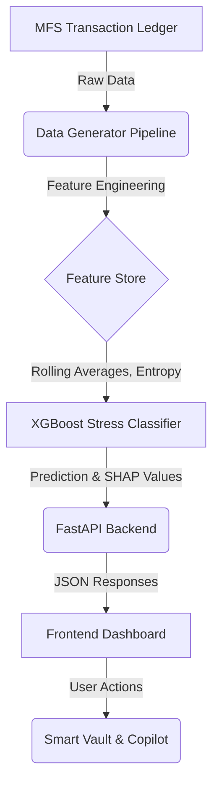

<div align="center">
  
  
  # 🧭 CashCompass
  **The Financial Health & Liquidity Workspace for the Next Billion Users**
  
  [](https://daffodilvarsity.edu.bd/)
  []()
  []()
  []()
  []()

  <p align="center">
    <a href="#-the-problem">The Problem</a> •
    <a href="#-our-solution">Our Solution</a> •
    <a href="#-key-innovations">Innovations</a> •
    <a href="#-system-architecture">Architecture</a> •
    <a href="#-getting-started">Getting Started</a>
  </p>
</div>

---

## 🚨 The Problem
In emerging markets like Bangladesh, millions of Mobile Financial Services (MFS) users live paycheck to paycheck. Traditional banking apps only show *current* balances, leaving users blind to **future liquidity crunches**. This leads to:
- **Avoidable Fee Leakage**: Paying high cash-out fees today, only to lack funds for a digital utility bill tomorrow.
- **Predatory Debt Traps**: Taking high-interest micro-loans due to poor cash-flow visibility.
- **Financial Stress**: Anxiety driven by unexpected expenses and lack of an emergency buffer.

## 💡 Our Solution
**CashCompass** transforms a standard MFS wallet into a **predictive financial health engine**. By analyzing deterministic behavioral data (burn rates, income entropy, spending velocity), CashCompass accurately forecasts cash-flow deficits up to 30 days in advance and proactively guides users away from financial stress using explainable, culturally-grounded AI.

---

## 🧠 5-Core Production AI Modules Breakdown

### Module 1: Conformal Multi-Wallet Balance Forecaster (LightGBM Quantile Regressor)
- **Role:** Shob connected MFS wallet (bKash, Nagad, Rocket, upay) er agami 15–30 diner balance curve predict kore.
- **Function:** Kono specific wallet e shortfall hobar aage auto-rebalance alert dey.

### Module 2: Calibrated Liquidity Crunch Predictor (Calibrated XGBoost)
- **Role:** Masher shesh 7 dine wallet pool critical limit (< ৳500) er niche nambe kina tar calibrated risk probability score (0.0 to 1.0) hishab kore.

### Module 3: Intelligent Interoperability Routing & Fee Optimizer (Graph Search + Policy ML)
- **Role:** User jokhon cash withdraw ba transfer korte chay, system instantly bKash/Nagad/Rocket er live fee, agent availability, ebong platform charge calculate kore shobcheye kom khorocher cheapest withdrawal route recommend kore.

### Module 4: Multi-Wallet Anomaly & Sybil Abuse Sentinel (Isolation Forest + Graph Anomaly)
- **Role:** Multi-wallet cross transfers er moddhe suspicious layering, rapid micro-cashouts, ba money mule pattern track kore security ensure kore.

### Module 5: TreeSHAP Feature Attribution & Grounded Bangla Copilot (XAI + LLM Guardrails)
- **Role:** Mathematical risk drivers (e.g., fee leakage) ke explain kore ebong user ke plain Bangla te non-predatory financial guidance shonay.

---

## 🏗️ System Architecture



### 📂 Repository Structure
- `src/api/` - Production-grade FastAPI backend, routing, and Pydantic schemas.
- `src/models/` - Machine learning inference layers and model wrappers.
- `frontend/` - Premium, glassmorphism-inspired Vanilla CSS/JS dashboard UI.
- `data/generator/` - Synthetic financial ledger generator simulating diverse user personas.
- `scripts/` - Automated model training and deployment scripts.
- `notebooks/` - Exploratory Data Analysis (EDA) and model validation metrics.

---

## 🛠️ Tech Stack
| Tier | Technologies Used |
| :--- | :--- |
| **Frontend UI** | HTML5, CSS3 (Custom Variables, Animations), Vanilla JS, Chart.js |
| **Backend API** | Python 3.10+, FastAPI, Uvicorn, Pydantic |
| **Data & AI** | XGBoost, TreeSHAP, Pandas, Scikit-Learn |
| **Database** | Motor (Async MongoDB) |

---

## 🚀 Getting Started

### Prerequisites
- Python 3.10+
- Node.js (Optional, for serving the frontend)
- Git

### 1. Clone & Setup Backend
```bash
# Clone the repository
git clone https://github.com/shuvosinghpartho/CashCompass-Diu_Ai_Hackathon.git
cd CashCompass-Diu_Ai_Hackathon

# Setup virtual environment
python3 -m venv venv
source venv/bin/activate

# Install dependencies
pip install -r requirements.txt
```

### 2. Boot the API Server
```bash
# Start the FastAPI Uvicorn server
uvicorn src.api.main:app --host 0.0.0.0 --port 8000 --reload
```
*The API will be available at `http://localhost:8000`. API Docs available at `http://localhost:8000/docs`.*

### 3. Launch the Frontend Dashboard
Open a new terminal window:
```bash
cd CashCompass-Diu_Ai_Hackathon/frontend
python3 -m http.server 3000
```
*Navigate to `http://localhost:3000` to view the interactive dashboard.*

---

## 🛡️ Responsible AI & Hackathon Compliance
CashCompass is built from day one to adhere to **Responsible AI Guidelines**:
1. **Zero Demographic Bias**: Our ML models strictly ingest behavioral metrics (velocity, timing, burn rate). Features like gender, religion, or ethnicity are programmatically excluded from the training pipeline.
2. **Transparent Decisioning**: Every risk score is audited via SHAP, ensuring users are never scored negatively without a mathematical, explainable reason.
3. **Anti-Predatory Guardrails**: The architecture prevents the copilot from ever suggesting micro-loans or high-interest credit lines as a first response to liquidity stress.

<br>

<div align="center">
  <sub>Built with ❤️ for the <b>DIU AI Hackathon 2026</b></sub>
</div>
